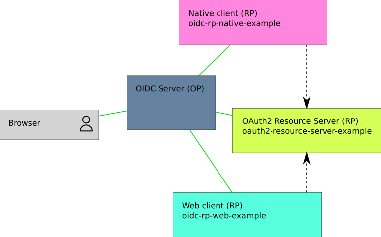

oidc-rp-web-example
===================

[](https://travis-ci.org/madarche/oidc-rp-web-example)

OpenID Connect Relying Party (RP) *web client* (like a web site) example


Architecture
------------

This example needs an OIDC Server (OP) and optionnaly an OAuth2 Resource Server
(https://github.com/madarche/oauth2-resource-server-example).




Usage
-----

It is assumed that this application will run as
https://oidc-rp-web-example.local.test/. One can change this URL with whatever
other URL.

First, write the `config.tom` config file.

Optionally set the `resources.url` propriety with the URL of the OAuth2 Resource Server route.

```shellsession
cp config.toml.example config.toml
vim config.toml
```

Next, register the RP in the OP with the following properties:

* `client_id` : the same as the `client_id` set in the `config.toml`
* `redirect_uris` : `https://oidc-rp-web-example.local.test/logged_in`
* `post_logout_redirect_uris` : `https://oidc-rp-web-example.local.test/logged_out`
* `application_type` : `web`
* `token_endpoint_auth_method` : `client_secret_basic`
* `client_secret` : the same as the `client_secret` set in `config.toml`

Then, install the needed packages and start the application:

```shellsession
npm ci
npm start
```

Finally, visit the application at https://oidc-rp-web-example.local.test/


### When the OP uses self-signed certificate

If the OP uses a self-signed certificate, one gets the following error:
```
RequestError: self signed certificate
```

The solution is, prior to the  `npm start` command, to specify the certificate
to Node.js, for example:

```shellsession
export NODE_EXTRA_CA_CERTS=/etc/nginx/ssl/cert/local.test.crt
```
